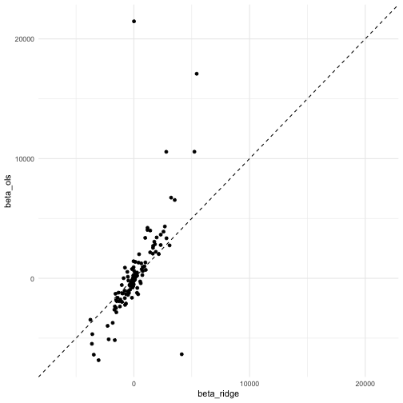
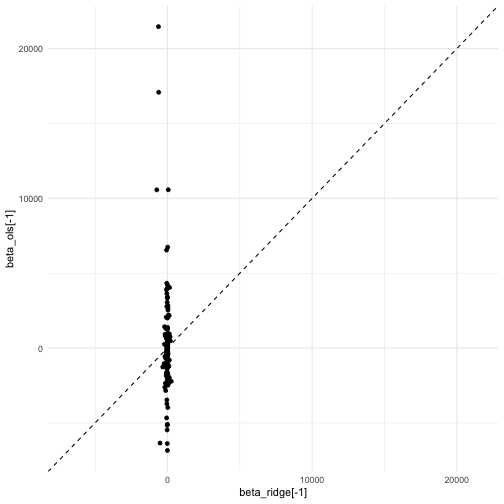
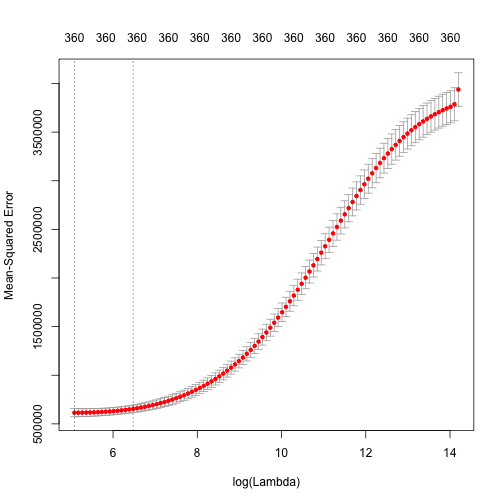

## The genlasso package

The package that we will use for ridge regession---as well as lasso
regression, logistic regression, and the elastic net---is called **glmnet**.
Run the code here to check that you have the package and, if not, install it:


if (!require("glmnet"))
{
  install.packages("glmnet")
}


Then you should be ready to go for the next few class periods.


library(readr)
library(dplyr)
library(glmnet)
library(ggplot2)
theme_set(theme_minimal())


## Ridge regression

Today we will use a dataset from a bike-sharing program in Washington D.C.
The prediction task is to learn how many bikes will be rented on a particular
day based on weather and time variables.


bikes <- read_csv("https://statsmaths.github.io/ml_data/bikes.csv")
bikes



## # A tibble: 731 x 10
##    obs_id train_id count season  year workingday weather  temp humidity
##    <chr>  <chr>    <dbl> <chr>  <dbl>      <dbl> <chr>   <dbl>    <dbl>
##  1 id_00… train      985 Winter     0          0 Rain     6.72    0.806
##  2 id_00… train      801 Winter     0          0 Rain     7.99    0.696
##  3 id_00… train     1349 Winter     0          1 Dry     -3.04    0.437
##  4 id_00… test        NA Winter     0          1 Dry     -2.8     0.590
##  5 id_00… train     1600 Winter     0          1 Dry     -1.02    0.437
##  6 id_00… test        NA Winter     0          1 Dry     -2.51    0.518
##  7 id_00… test        NA Winter     0          1 Rain    -3.03    0.499
##  8 id_00… valid      959 Winter     0          0 Rain    -5.11    0.536
##  9 id_00… valid      822 Winter     0          0 Dry     -6.87    0.434
## 10 id_00… train     1321 Winter     0          1 Dry     -6.05    0.483
## # … with 721 more rows, and 1 more variable: windspeed <dbl>


Now, I will make a model matrix and response vector, but this time with a larger set of
variables. I will add the term `-1` to the formula to stop R from adding an intercept 
because the **glmnet** package will do that automatically for us. I also use `*` (multiplication)
to include all of the cross-terms. This creates a much larger matrix `X` that is more
condusive to showing the benefits of using ridge regression:


y <- bikes$count
X <- model.matrix(~ -1 + season * year * workingday * weather * temp * humidity * windspeed,
                  data = bikes)
dim(X)



## [1] 731 384


Now, we will split out the data into a training and validation (what we are using as our
test set):


y_train <- y[bikes$train_id == "train"]
y_valid <- y[bikes$train_id == "valid"]
X_train <- X[bikes$train_id == "train",]
X_valid <- X[bikes$train_id == "valid",]


Now, to run the ridge regression all we need is call the function `glmnet` and
make sure to specify `alpha=0` (otherwise, it would use a different algorithm
call lasso regression, which we will see soon). We can also specify the value
of lambda. The `coef` function takes the model and shows us the predicted value
of $$\beta_\lambda$$:


model <- glmnet(X_train, y_train, alpha = 0, lambda = 1)
as.numeric(coef(model))



##   [1]  3.085991e+03 -1.017775e+03 -5.241577e+02  1.894089e+03 -8.080902e+02
##   [6]  2.711702e+02  1.970695e+03 -1.276519e+02 -1.686238e+03  1.384897e+02
##  [11] -2.724512e+01  2.248450e+01  2.937797e+02  2.654031e+02  2.316167e+03
##  [16] -3.365611e+02  5.428115e+02 -1.517937e+03  7.644219e+02 -3.596037e+03
##  [21] -2.181820e+03 -1.533477e+03  3.990183e+02 -3.466216e+03  1.838158e+01
##  [26]  1.650475e+03 -1.467345e+01  1.764606e+03 -1.633003e+02  6.771189e+00
##  [31] -1.147615e+02 -1.248397e+02  1.438988e+02 -5.391156e+01  1.713504e+00
##  [36]  3.471666e+01  9.918965e+02 -1.205154e+03 -9.583324e+02 -7.629895e+02
##  [41] -6.842476e+02 -5.218126e+02  5.010242e+01  4.453380e+01 -3.334703e+01
##  [46]  5.158402e+01 -1.661362e+00  1.515303e+01 -4.407481e+01  3.018892e+01
##  [51]  2.007769e+00 -5.869795e-01 -3.069746e+00  2.388375e+01 -8.883999e+02
##  [56] -1.166530e+03 -1.589849e+03 -1.539860e+03 -6.825371e+02 -1.644051e+03
##  [61]  0.000000e+00  4.489495e+02 -1.237616e+03 -5.665878e+02  2.630221e+02
##  [66]  7.299908e+02  1.413164e+03  1.634604e+03  9.117920e+02 -5.068623e+02
##  [71] -4.144048e+01 -8.727841e+01  1.275629e+02 -4.179485e+01 -8.154904e+00
##  [76] -6.219010e+00 -7.363328e+01  6.915934e+01 -5.286865e+01  5.801977e+01
##  [81] -9.371977e+01 -4.154174e+00  1.819566e+01  6.331113e+01 -5.316354e+01
##  [86]  7.734614e+00 -1.061533e+01  1.405009e+03  1.173399e+03 -1.328924e+03
##  [91]  2.676690e+03  1.821926e+03 -2.386498e+01  6.727948e+02 -7.828667e+02
##  [96]  2.156637e+03 -5.499575e+01 -4.236298e+02 -7.736499e+02  1.026677e+03
## [101] -2.271715e+03 -6.858270e+01 -1.830974e+03 -3.826136e+02 -1.529143e+02
## [106] -2.614054e+01  1.474342e+02  1.230447e+02 -7.993352e+01 -7.751805e+00
## [111]  1.505746e+01  4.545977e+01  9.117607e+01 -2.738062e+01 -4.265624e+01
## [116] -1.139929e+01  7.812935e+00 -7.452996e+00  1.055366e+02 -5.728285e+01
## [121]  1.005678e+01 -8.048374e+00  3.718695e+01  3.935353e+00  5.594836e+01
## [126] -7.981474e+00  1.448266e+01 -4.293220e+00  2.042826e+00 -2.270839e+00
## [131]  1.294188e+00 -1.840208e+00  2.815053e-01 -2.556587e+00  8.739026e-01
## [136] -2.094792e+01  3.463460e+01 -7.005378e+01  2.201667e+01  4.872171e+00
## [141] -3.012480e+01 -2.193548e+01 -9.612670e-01  2.818052e+03  1.179422e+03
## [146] -3.630150e+03  0.000000e+00  0.000000e+00  7.644002e+02  6.985950e+01
## [151]  4.068319e+01 -1.460091e+02  1.138835e+02 -3.226615e+01 -7.361754e+01
## [156] -7.595092e+01  0.000000e+00 -1.404476e+03 -8.120197e+01  1.213442e+00
## [161] -3.441116e+01  2.281314e+01  3.830950e+01 -1.602481e+02 -1.858739e+02
## [166]  4.135892e+03 -1.469065e+03  5.917557e+02  1.663919e+03 -3.758331e+03
## [171]  5.232797e+03  3.530049e+03 -1.047410e+03  0.000000e+00 -1.687330e+02
## [176]  2.321737e+03  3.214704e+03  2.562286e+03  1.106614e+02  2.695065e+02
## [181]  6.371701e+02  1.280536e+02 -1.006726e+03 -1.474898e+02 -1.844346e+02
## [186] -1.483223e+02  1.530427e+01 -1.267777e+01  1.822936e+02 -8.426685e+01
## [191]  1.234942e+02  6.519046e+01  2.192629e+02  4.971773e+01  9.516181e-01
## [196] -4.738780e+02  1.290808e+02  7.432893e+00 -2.687444e+01 -4.116241e+00
## [201] -3.777896e+01 -3.065114e+01 -9.116903e+00  1.084600e+02 -3.978927e+01
## [206]  1.402920e+01  3.496197e+00  0.000000e+00 -8.523753e+00 -1.270952e+01
## [211] -2.211029e+01 -4.021863e+01 -1.705868e+01 -7.140905e+00 -1.238254e+00
## [216]  6.279340e+00 -6.990016e+00 -3.015241e+00  1.267501e+00  2.733169e+00
## [221]  1.135846e+00  9.198240e-01 -1.434023e+00 -3.592101e-01 -1.476957e+00
## [226]  8.082389e-01 -4.046949e+00  1.229483e+00 -6.362171e-01 -1.204307e+00
## [231] -1.874064e+00  9.262863e-01  1.193524e+00  7.395202e-01  1.574418e+02
## [236]  1.497710e+02 -4.587506e+01 -7.697129e+01 -4.532372e+01  8.787254e+01
## [241]  3.873150e+01  9.935737e+01  1.036132e+00 -2.990564e+01 -2.174992e+01
## [246]  1.740326e+01 -1.913885e+01 -1.346943e+02 -3.332030e+01 -8.224720e+01
## [251] -3.889237e+01 -1.565985e-01 -7.272049e-01 -6.956215e-01 -4.069007e+00
## [256]  2.806393e+00 -2.529921e-01 -8.134274e-01  1.206625e+02  1.219992e+02
## [261] -3.206290e+01  0.000000e+00  0.000000e+00  9.616706e+00  3.694681e+02
## [266] -3.051706e+03 -2.305034e+02  0.000000e+00  0.000000e+00  8.775196e+01
## [271] -2.195307e+01  1.606259e+02 -1.847835e+01 -1.037477e+02 -7.932295e+01
## [276]  1.415495e+02 -8.774421e+01  0.000000e+00 -1.650637e+03  8.098259e+01
## [281] -5.054978e+01 -3.154667e+02  9.803040e+02  3.274018e-02  1.014036e+02
## [286] -3.478531e+01  2.799257e+03 -5.635842e+01  5.609506e+01  8.144657e+01
## [291]  0.000000e+00  0.000000e+00  2.078327e+00  3.265644e+00 -1.895130e+00
## [296]  4.398379e+00  2.443897e+00 -4.954253e-02 -7.476375e+00 -6.752711e-01
## [301]  0.000000e+00 -1.886695e+01 -4.333952e+00  2.451342e+00  2.316340e+00
## [306]  2.167039e+01  3.165180e-01  4.194949e-01 -5.953683e-01  2.182279e+01
## [311] -7.189634e+01 -2.384023e+02 -4.294186e+00  2.754732e+00  4.896668e+01
## [316]  6.373390e+01 -8.195577e+00  0.000000e+00 -3.121506e+00  1.849011e+00
## [321] -1.078540e+02  8.983295e+01  5.087627e+00 -3.532381e+00 -1.411356e+00
## [326] -6.989312e+01 -7.555653e-01 -2.360738e+00 -4.116210e+00 -1.318189e+01
## [331]  3.310845e+00  7.326950e-01 -2.829476e+00  3.499456e+00 -2.163272e+00
## [336]  4.863172e+00  7.929374e+00  9.674146e-01 -2.743112e-01  2.401074e+00
## [341]  1.637450e+00  6.446479e-01  3.660159e+00  6.380455e-01 -3.450482e+00
## [346] -6.072117e-01  6.124249e+01  0.000000e+00  0.000000e+00  5.427864e+03
## [351] -2.516001e+00  6.437689e+00  6.619277e+00  0.000000e+00  0.000000e+00
## [356]  6.605267e+01 -7.334263e+01 -2.489147e+02 -7.622648e+01  0.000000e+00
## [361]  0.000000e+00 -9.559790e-01  1.600302e+00  6.349613e+00  8.951814e+00
## [366] -8.358997e+00 -6.948917e+00 -2.450462e+01  9.289445e-01  0.000000e+00
## [371] -2.949741e+00  2.476051e+00 -2.032237e+00 -6.106453e+00  2.201441e+00
## [376] -5.177031e-01 -2.820261e+00  7.078617e+00  6.089238e+01  3.151920e-01
## [381] -1.374794e+00  2.334369e+01  0.000000e+00  0.000000e+00  6.227384e+01


We can compare this to the ordinary least squares by simply setting $\lambda = 0$.


beta_ridge <- as.numeric(coef(glmnet(X_train, y_train, alpha = 0, lambda = 1)))
beta_ols <- as.numeric(coef(glmnet(X_train, y_train, alpha = 0, lambda = 0)))
qplot(beta_ridge, beta_ols) +
  geom_abline(slope = 1, intercept = 0, linetype="dashed") +
  scale_x_continuous(limits = range(c(beta_ridge[-1], beta_ols[-1])))


Notice that the values are reasonably correlated and generally (but not always) small
in the ridge regression compared to the OLS regression. If we make lambda much larger,
now equal to 5000, you can see that the values in the regression vector all start converging
to zero:


beta_ridge <- coef(glmnet(X_train, y_train, alpha = 0, lambda = 5000))
beta_ols <- coef(glmnet(X_train, y_train, alpha = 0, lambda = 0))
qplot(beta_ridge[-1], beta_ols[-1]) +
  geom_abline(slope = 1, intercept = 0, linetype="dashed") +
  scale_x_continuous(limits = range(c(beta_ridge[-1], beta_ols[-1])))


## Cross-validation

How do we pick a good value for lambda when doing prediction tasks? A common
method is called k-fold cross validation:

1. Split observations in the dataset into k buckets.
2. Fit the model on all of the data in buckets 2-k for several values of $$\lambda$$.
3. Use this model to predict values in bucket k.
4. Repeat for all of the other buckets (remove just one bucket of data, fit model, and predict on the left-out set).
5. Use the value of lambda that best predicts the data across all of the buckets.

Conveniently, the R package has a simple way of doing cross validation using the
`cv.glmnet` function. Plotting the model shows a curve of how good each value of
$$\lambda$$ performs across all of the buckets:


model <- cv.glmnet(X_train, y_train, alpha = 0)
plot(model)


What's the best value for lambda according to cross-validation?


model$lambda.1se



## [1] 650.4179


## Comparing the models

Here is the code to see how well (in terms of the mean squared error) the
ordinary least squares does on the training and validation sets:


model_ols <- glmnet(X_train, y_train, alpha = 0, lambda = 0)
y_hat <- predict(model_ols, newx = X, s = 0)
sqrt(tapply((y - y_hat)^2, bikes$train_id, mean))



##      test     train     valid 
##        NA  427.7038 3549.1104


Now, how about the cross-validated model:


model <- cv.glmnet(X_train, y_train, alpha = 0)
y_hat <- predict(model, newx = X, s = model$lambda.1se)
sqrt(tapply((y - y_hat)^2, bikes$train_id, mean))



##      test     train     valid 
##        NA  708.9125 3270.6698


Notice that the penalty makes the model fit worse on the training set
by generalizes better to new datasets.

